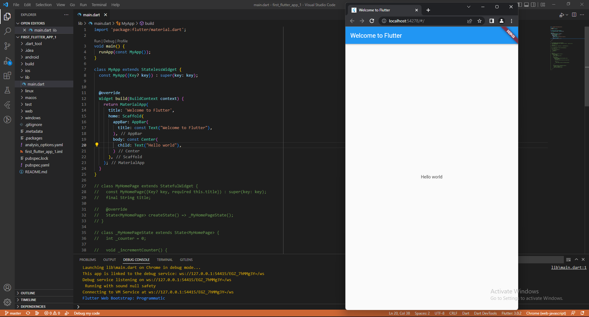
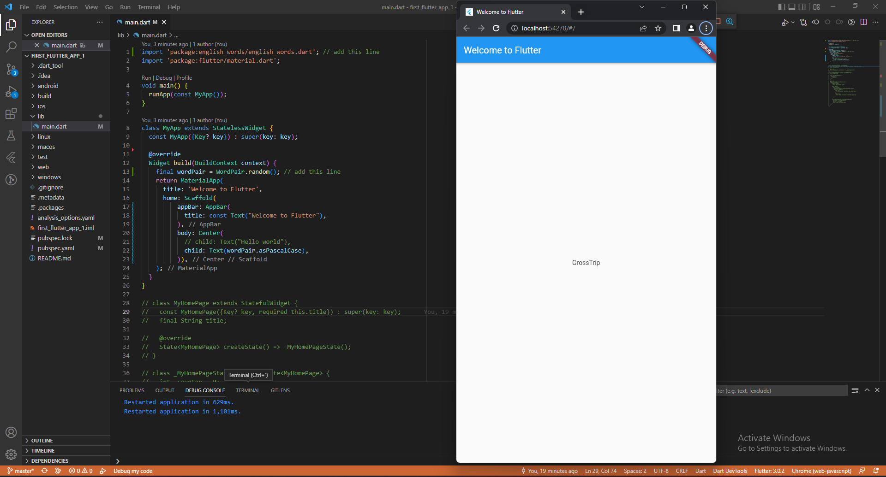
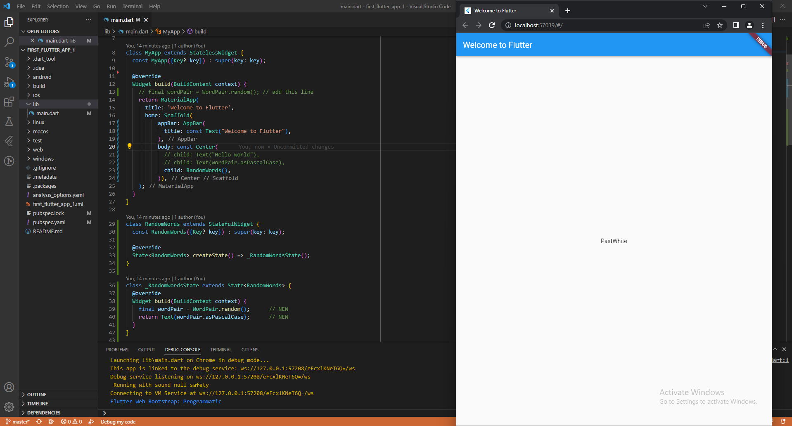

# first_flutter_app_1

Praktikum 20 DTS TSA 2022

# Praktikum 1: Create the Starter Flutter App

Pada praktikum kali ini membuat project baru dengan mengubah NameBar dan isi text.

# Praktikum 2: Use an external package

- Pada praktikum kali ini kita menambahkan package english_word
- Tampilan pada aplikasi ini menampilkan text yang terdapat pada package english_word

# Praktikum 3: Add a stateful widget

- Pada praktikum kali ini menambahkan stateful widget pada class RandomWords
- Stateful widget adalah widget yang memiliki state yang dapat berubah. Pada contoh ini kita akan membuat stateful widget yang akan menampilkan kata-kata secara acak. WordPair adalah class yang akan kita gunakan untuk menampilkan kata-kata secara acak. Pada class RandomWordsState kita akan membuat state untuk menampung kata-kata yang sudah ditampilkan. asPascalCase adalah method yang akan mengubah kata menjadi PascalCase.

# Praktikum 4: Create an infinite scrolling ListView

- Pada praktikum kali ini membuat scrolling list view yang berisikan kata-kata yang terdapat pada package english_word
- _suggestions adalah list yang akan menampung kata-kata yang sudah ditampilkan dan _biggerFont adalah method yang akan mengubah ukuran font.
- itemBuilder: (context, i) adalah method yang akan menampilkan item pada list.
- isOdd adalah method yang akan mengecek apakah i ganjil atau genap.
- Divider() adalah widget yang akan menampilkan garis pemisah.
- index ~/ 2 adalah method yang akan mengembalikan hasil bagi i dengan 2.
- take(10) adalah method yang akan mengambil 10 item dari list.
- generateWordPairs() adalah method yang akan mengembalikan list kata-kata secara acak.
- addAll() adalah method yang akan menambahkan list ke list lainnya.
- ListTile adalah widget yang akan menampilkan item pada list.
- _suggestions[index] adalah method yang akan mengambil kata-kata pada list _suggestions.